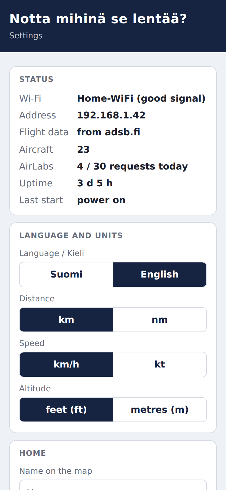

# Notta mihinä se lentää?

A live flight-tracking display for the Waveshare ESP32-S3-Touch-LCD-7. It shows aircraft around a configured home location on a touch-controlled map, with route, flight data and aircraft photos for the selected flight.

The name is Finnish for "So, where's that one flying to?". The user interface is in English by default, with Finnish available as a setting on the device; the code and documentation are in English.

**[Interactive demo](https://n41kh05.github.io/notta-mihina-se-lentaa/simulator.html?v=10)**: the firmware's rendering, touch and data-parsing code compiled to WebAssembly, running in the browser with simulated traffic.

## Features

| | |
|---|---|
|  | **Live map.** Aircraft positions update every 4 seconds and are interpolated between updates. The embedded vector map covers coastlines, lakes, towns, airports and runways. Pan and pinch-zoom from airport level to the whole world. Aircraft are colour-coded by altitude. |
|  | **Flight details.** For the selected flight, the panel shows the route with origin and destination, estimated arrival, altitude, vertical rate, ground speed, track, distance and aircraft type. An aircraft photo is loaded from Planespotters.net, with photographer credit and a QR link to the source page. |
|  | **Localisation.** Finnish and English interface, map labels and number formatting, switchable in Settings or on the phone page. Units are selectable: km/nm, km/h/kt, ft/m. |
|  | **Guided setup.** Wi-Fi is configured on the touchscreen. The home location is set by address search (OpenStreetMap Nominatim, with an offline fallback to the built-in town list), then fine-tuned on the map. |
|  | **Web configuration.** A settings page served on the local network covers language, units, home location, night schedule, photos and an optional AirLabs API key for scheduled departure and arrival times. |

### Security

HTTPS with certificate verification for all outgoing requests, and the settings page is protected against cross-site requests and DNS rebinding. An optional password is available for the settings page. See [GUIDE.md](GUIDE.md#security) for details and limitations.

### Reliability

- Automatic Wi-Fi reconnection with back-off after power or network outages
- Task watchdog (90 s) and a scheduled daily restart during idle night hours
- Night mode with automatic screen off and on
- All settings persisted in flash (NVS)

## Hardware

- [Waveshare ESP32-S3-Touch-LCD-7](https://www.waveshare.com/esp32-s3-touch-lcd-7.htm), 800×480, capacitive touch version
- USB-C cable and a 5 V power supply rated at 1 A or more
- Optional: the 3D-printable enclosure in [`case/`](case/)

No soldering or additional wiring is required.

## Quick start

1. Install the Arduino IDE 2 and the Espressif ESP32 board package (3.x).
2. Install the libraries **Adafruit GFX**, **ArduinoJson** (v7) and **JPEGDEC**.
3. Open `SkyTracker/SkyTracker.ino` and select the board options: ESP32S3 Dev Module, 16 MB flash, OPI PSRAM, custom partition scheme, USB CDC on boot.
4. Upload.
5. On first start, select a Wi-Fi network and set the home location on the device.

See **[GUIDE.md](GUIDE.md)** for full installation, configuration and troubleshooting instructions.

## Enclosure

[`case/`](case/) contains a fully enclosed case with two fold-out legs that hold the display at a 20° tilt. The USB-C ports are reached through openings in the side wall. It prints without supports and is defined as a parametric OpenSCAD model. Board dimensions should be verified before printing; see [`case/README.md`](case/README.md).

## Repository layout

| Path | Contents |
|---|---|
| [`SkyTracker/`](SkyTracker/) | Firmware (Arduino sketch). Build-time settings are in `config.h`. |
| [`simulator/`](simulator/) | Browser simulator build (WebAssembly) |
| [`proxy/`](proxy/) | Optional CORS proxy (Cloudflare Worker) for live data in the browser demo |
| [`case/`](case/) | Enclosure: OpenSCAD source, STL files, print and assembly guide |
| [`tools/`](tools/) | Map and font generators (`make_map.py`, `make_fonts.py`) |
| [`docs/`](docs/) | Project website (GitHub Pages) |

## Data sources

| Data | Source |
|---|---|
| Aircraft positions | [adsb.fi](https://adsb.fi), [airplanes.live](https://airplanes.live), [adsb.lol](https://adsb.lol), with automatic failover |
| Routes | [adsbdb.com](https://www.adsbdb.com) |
| Aircraft photos | [Planespotters.net](https://www.planespotters.net); displayed with credit, not stored |
| Scheduled times (optional, API key) | [AirLabs](https://airlabs.co) |
| Address search | [Nominatim](https://nominatim.org), © OpenStreetMap contributors |
| Base map | [Natural Earth](https://www.naturalearthdata.com) (public domain) |
| Airports and runways | [OurAirports](https://ourairports.com) (public domain) |

The live-position services are free for personal, non-commercial use. The firmware rate-limits its requests; please observe each service's terms.

## License

Released under the [MIT License](LICENSE). Third-party components:

| Component | License |
|---|---|
| QR code generator (`SkyTracker/qr.c`, `qr.h`), Richard Moore | MIT |
| Display fonts (`SkyTracker/fonts.h`), generated from DejaVu Sans | Bitstream Vera / DejaVu |
| Map data (`SkyTracker/mapdata.cpp`), from Natural Earth and OurAirports | Public domain |
| Adafruit GFX Library (compiled into the simulator; required by the firmware) | BSD |
| ArduinoJson (required, not included) | MIT |
| JPEGDEC (required, not included) | Apache 2.0 |
