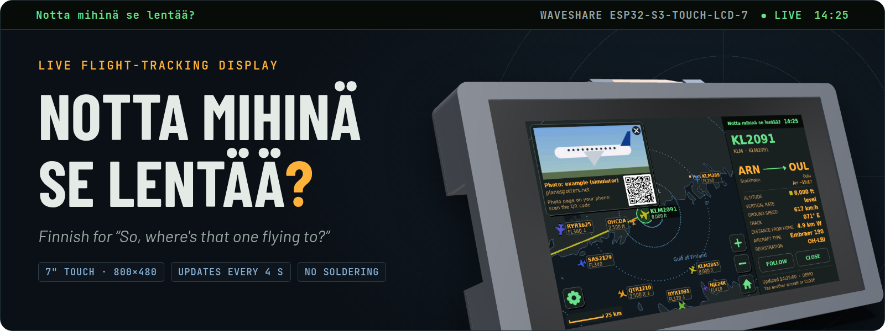
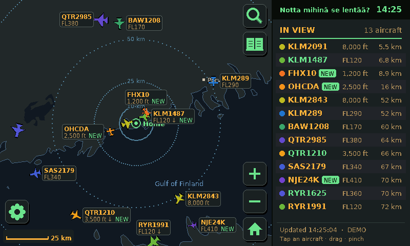
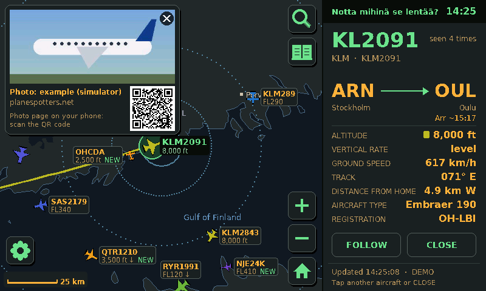
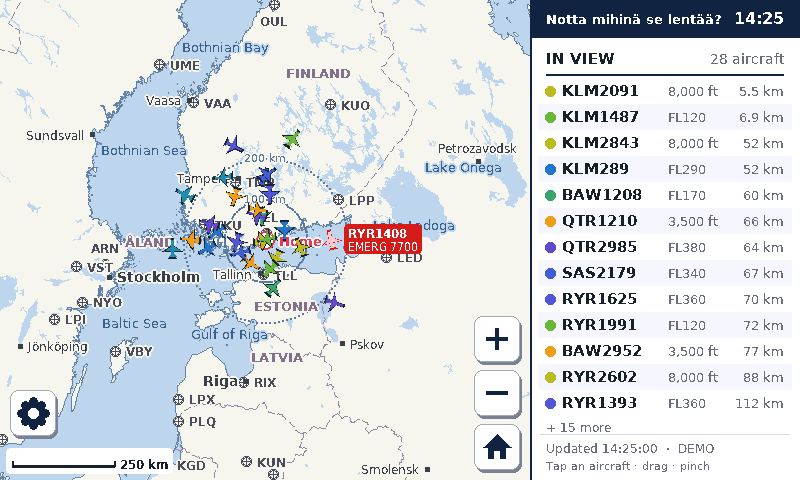
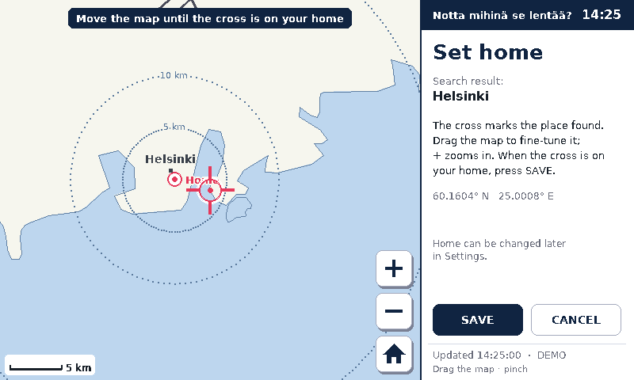
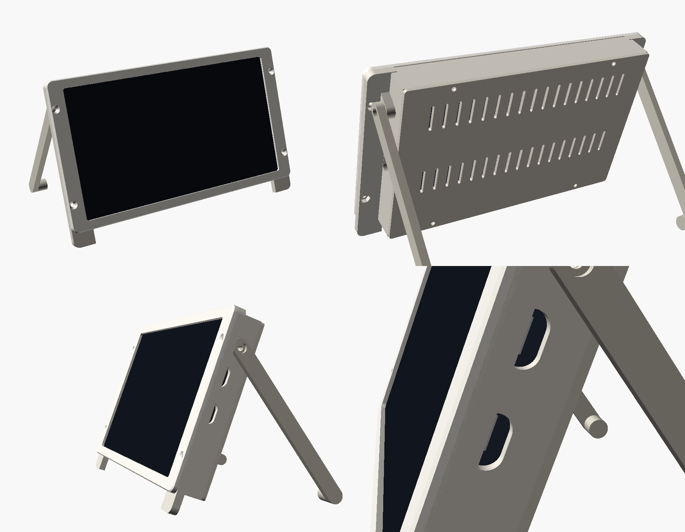

  

  
  
  
  

A desk display that shows the planes flying around you. It runs on a Waveshare ESP32-S3-Touch-LCD-7, which is a 7" touchscreen with an ESP32-S3 on the back, so there's nothing to wire up. Drag and zoom the map, tap a plane, and you get its route, altitude, speed, type and usually a photo of that exact aircraft.

The name is Finnish, roughly "so, where's that one flying to?". The screen is in English by default and can be switched to Finnish.

You can [try it in the browser](https://n41kh05.github.io/notta-mihina-se-lentaa/simulator.html) before buying anything. That page runs the firmware's own drawing and touch code compiled to WebAssembly, with made-up traffic.

<table>
  <tr>
    <td width="50%"> <b>THE MAP</b> · planes around home, coloured by altitude</td>
    <td width="50%"> <b>TAP A PLANE</b> · route, flight data and a photo</td>
  </tr>
  <tr>
    <td width="50%"> <b>ZOOM OUT</b> · from one airport to the whole world</td>
    <td width="50%"> <b>SET HOME</b> · search an address, then fine-tune on the map</td>
  </tr>
</table>

## What it does

- **Live map.** Planes around home on a map with coastlines, lakes, towns and airports. Positions update every 4 seconds and the planes move smoothly in between. Colour shows altitude, and the icon shows the kind of aircraft: airliner, wide-body, business jet, propeller plane, light aircraft, helicopter or glider.
- **Flight details.** Tap a plane for its route (e.g. ARN → OUL), estimated arrival, altitude, climb rate, speed, heading, distance and aircraft type. The aircraft's registered owner shows up where it adds something: for planes with no airline, or when the plane is leased. The map draws the path it has flown since take-off, coloured by altitude.
- **Photos.** Aircraft photos from Planespotters.net, with the photographer's name and a QR code to the photo page.
- **Dark mode.** Amber and green on near-black, either always on or switching at sunset and sunrise.
- **Easy setup.** Wi-Fi and home location are set up on the touchscreen. Home can be found by address search.
- **Phone settings page.** Units, language, dark mode, home, night hours, photos, and an optional AirLabs key for scheduled times.
- **Updates like a phone.** GitHub builds the firmware on every change, and the device offers new versions with install now / later / skip, falling back to the previous version if a new one doesn't start.
- **Made to be left running.** It reconnects after power or router cuts, has a watchdog, turns the screen off at night and restarts itself once a day while idle.

## Building one

You need the board (the touch version), a USB-C cable and a 5 V / 1 A phone charger. No soldering.

1. Install the Arduino IDE 2 and the ESP32 board package 3.x.
2. Install the libraries Adafruit GFX and ArduinoJson (v7).
3. Open `SkyTracker/SkyTracker.ino` and set the board options: ESP32S3 Dev Module, 16 MB flash, OPI PSRAM, custom partition scheme, USB CDC on boot enabled.
4. Upload, then pick your Wi-Fi and home on the screen.

[GUIDE.md](GUIDE.md) has the details, the settings page and troubleshooting. After the first upload, new versions come over Wi-Fi.

## Case

There's a 3D-printable case in [`case/`](case/): a frame for the screen, a back plate that screws onto the screen's brass standoffs, and a fold-out kickstand that leans it back 20°. All the screws go in from the back, and the USB-C ports are reached through a small bay in the side. STLs, a STEP file and the print guide are in [`case/README.md`](case/README.md).

## Data

Positions come from [adsb.fi](https://adsb.fi), [airplanes.live](https://airplanes.live) and [adsb.lol](https://adsb.lol) (whichever answers), flight paths from adsb.lol's track history, routes and aircraft owners from [adsbdb](https://www.adsbdb.com), photos from [Planespotters.net](https://www.planespotters.net) and address search from [Nominatim](https://nominatim.org) (© OpenStreetMap contributors). Scheduled times need a free [AirLabs](https://airlabs.co) key. The map is built from [Natural Earth](https://www.naturalearthdata.com) and [OurAirports](https://ourairports.com), both public domain.

The position services are free for personal, non-commercial use. The firmware keeps its request rate low, but check their terms if you do anything bigger with it.

<b>What's in the repository</b>

- `SkyTracker/`: the firmware. `config.h` has the settings.
  - `SkyTracker.ino`: start-up, main loop, saved settings, Wi-Fi recovery
  - `model.h`: the shared data (planes, routes, settings) and the language switch
  - `board.cpp`: the display and touch hardware
  - `render.cpp`: drawing the map, planes, flight panel and text
  - `ui.cpp`: touch gestures and the full-screen menus (settings, Wi-Fi, home)
  - `net.cpp`: fetching flight data, routes and photos; `web.cpp`: the phone settings page
  - `demo.cpp`: simulated traffic
  - generated or third-party: `mapdata.cpp` (tools/make_map.py), `fonts.h` (tools/make_fonts.py), `qr.c`, `stb_image.h`
- `simulator/`: builds the browser version (`docs/sim.wasm`).
- `case/`: the enclosure (build script, STEP and STLs).
- `tools/`: scripts that generate the map data and fonts.
- `docs/`: the GitHub Pages site.

<b>License</b>

MIT, see [LICENSE](LICENSE). Bundled third-party code: the QR code generator in `qr.c` by Richard Moore (MIT), the JPEG decoder in `stb_image.h` by Sean Barrett (public domain / MIT), fonts generated from DejaVu Sans (Bitstream Vera license), and the map data (public domain). The firmware also needs ArduinoJson (MIT) and Adafruit GFX (BSD); Adafruit GFX is compiled into the simulator.

