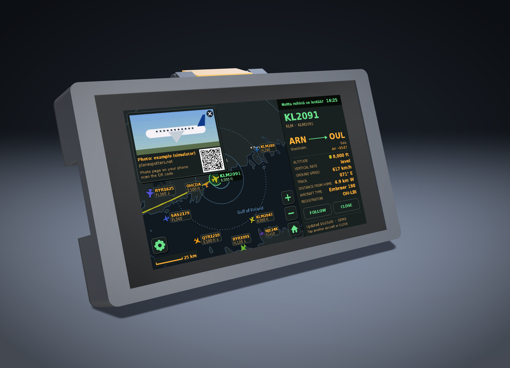
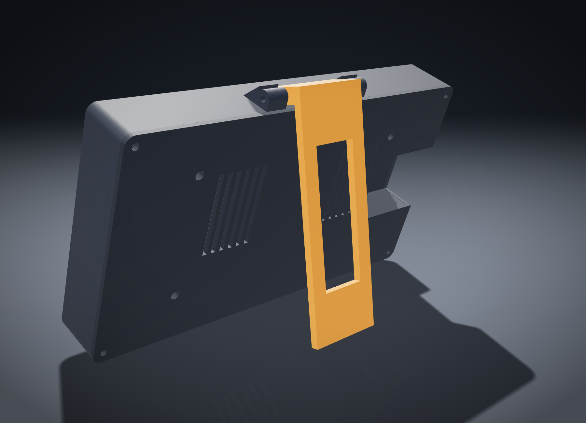
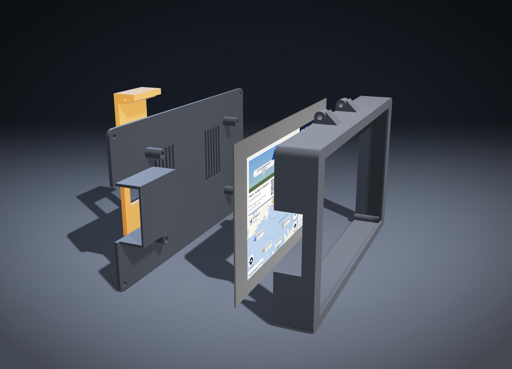
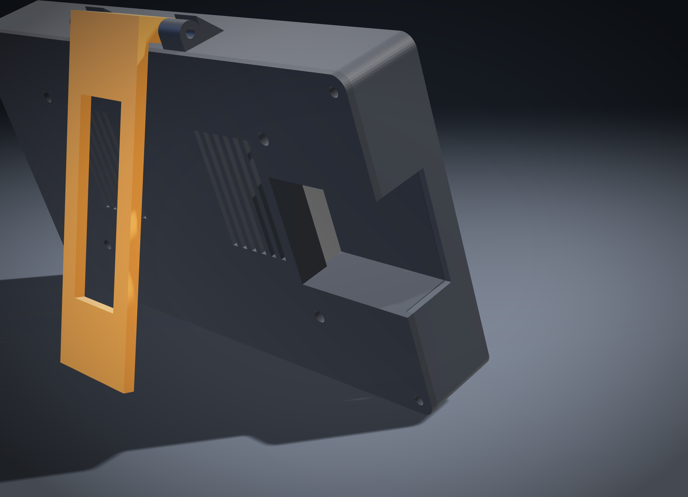
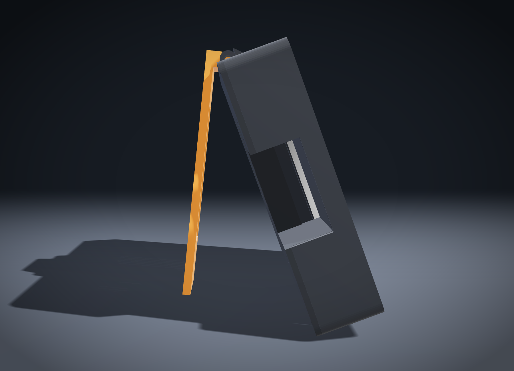

# Case

A printable case for the Waveshare ESP32-S3-Touch-LCD-7 (touch version). Three parts: a frame that holds the screen, a back plate that screws onto the screen's own brass standoffs, and a fold-out kickstand that leans the screen back 20°. Every screw goes in from the back, so the front is just the bezel and the glass.



| | |
|---|---|
|  |  |
|  |  |

## How it fits together

- **Frame:** bezel and walls in one piece. The screen drops in from the back, glass first, into a pocket behind the bezel lip. Nothing sticks into its path; the four screw posts sit in the corners outside the glass's rounded corners.
- **Back plate:** four posts land on the brass standoffs on the back of the screen and press it 0.2 mm forward against the lip, so it can't rattle. Four more screws hold the plate to the frame's corner posts.
- **USB bay:** both USB-C ports are 41 mm in from the edge of the glass, too deep to reach through a hole in the side. The back plate has a small tub that slides into an opening in the left wall (seen from the front). Plugs go in from the side through a window in the tub's inner wall; the rest of the board stays hidden. The upper port is USB (power, uploads, serial monitor), the lower one UART1.
- **Kickstand:** hinged on top of the frame. Folded, it lies flat on the back plate. Fold it out until it stops (a lug on the leg lands on the frame at 26°) and the screen leans back 20°, standing on the bottom edge of the back plate and the foot of the leg about 55 mm behind it. Tapping the screen pushes it towards the leg, so it doesn't tip.

The dimensions come from Waveshare's drawing and 3D model of the board. Before printing, check that the glass edge is no more than 1.8 mm thick (mine is about 1 mm).

## Printing

| Part | File | Orientation |
|---|---|---|
| Frame | `stl/frame.stl` | bezel face down |
| Back plate | `stl/back.stl` | outside face down |
| Kickstand | `stl/leg.stl` | flat side down |

No supports needed. The hinge blocks on the frame have 45° slopes under them, and the floor of the USB tub bridges 40 mm, which PETG handles fine.

The frame needs a bed of about 215 × 130 mm. I'd use PETG so it doesn't soften in a sunny window. 0.2 mm layers, 3 walls and 20–25 % infill are plenty, and the three parts come to roughly 110–130 g of filament.

## Hardware

- 4 × M3×18 with washers: back plate into the brass standoffs
- 4 × M3×10: back plate into the frame's corner posts (they cut their own thread)
- 2 × M3×20 with washers: kickstand hinge, one from each side
- Optionally two small rubber feet: one under the foot of the leg, one on the bottom edge

## Assembly

1. Screw the kickstand to the hinge blocks on top of the frame: one M3×20 from each side through the block into the leg. Tighten until the leg stays where you put it.
2. Lay the frame face down on a cloth and drop the screen in from the back, glass first.
3. Put the back plate on. The USB tub slides into the opening in the side wall next to the ports.
4. Put the four M3×18 screws through the posts into the standoffs, then the four M3×10 into the corners. Snug is enough; don't strip the plastic.
5. Plug the cable in through the side, fold the leg out and stand it up.

BOOT, RESET and the SD card slot end up inside. You don't need them normally; updates come over Wi-Fi. If you ever do, the back plate comes off with eight screws.

## Changing it

`step/case.step` has all three parts. Import it into Onshape, Fusion or FreeCAD if you want to edit the shapes directly.

The parts are also generated by [`build_case.py`](build_case.py), with the measurements at the top of the file (glass pocket, standoff positions, bay size, hinge position and opening angle). To rebuild the STL and STEP files:

```
pip install cadquery-ocp
python build_case.py
```
